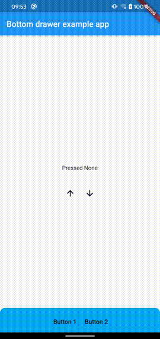

# Bottom Drawer for Flutter [](https://pub.dev/packages/bottom_drawer)

Bottom Drawer.



### 1. Add dependency

```dart
dependencies:
  bottom_drawer: ^0.0.2
```

### 2. Import bottom drawer

```dart 
import 'package:bottom_drawer/bottom_drawer.dart';
```

### 3. Use bottom drawer

Create a bottom drawer controller.

```dart
/// create a bottom drawer controller to control the drawer.
BottomDrawerController controller = BottomDrawerController();
```

Build a bottom drawer widget.

```dart
/// return a bottom drawer widget.
Widget buildBottomDrawer(BuildContext context) {
  return BottomDrawer(
    /// your customized drawer header.
    header: Container(),
    /// your customized drawer body.
    body: Container(),
    /// your customized drawer header height.
    headerHeight: 60.0,
    /// your customized drawer body height.
    drawerHeight: 180.0,
    /// drawer background color.
    color: Colors.lightBlue,
    /// drawer controller.
    controller: controller,
  );
}
```

Control the bottom drawer.

```dart
/// open the bottom drawer.
controller.open();

/// close the bottom drawer.
controller.close();
```

For more information, see the [example](https://github.com/GP-Moon/bottom_drawer/tree/master/example).

